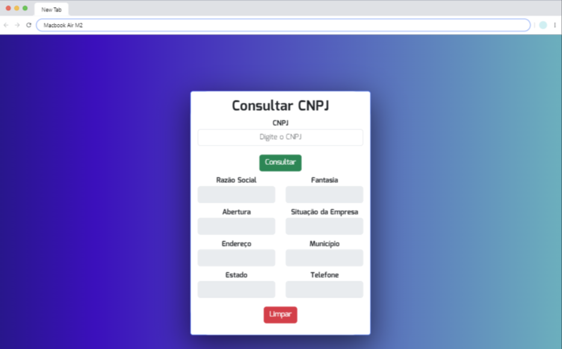

# Olá, eu sou a Andressa! 👋
## 🚀 Sobre mim
Eu sou uma pessoa desenvolvedora full-stack...

# Consulta CNPJ

A proposta para o desenvolvimento deste projeto foi consumir a API da Recita Federal e obter os dados respectivos do CNPJ pesquisado. Utilizando dos recursos aprendidos durante as aulas do curso de programação FullStack.
- [ConsultaCNPJ](https://andressa-l.github.io/consulta-cnpj/)

## Funcionalidades

- Exibição de Razão Social, Nome Fantasia, Abertura, Situação da empresa, endereço, Município, Estado e Telefone.
- Personalização de estilo: o app que mostra a consulta do CNPJ foi personalizado com fontes, cores, tamanhos e formatos de exibição.
- Botão limpar quando acionado limpa os campos de consulta.

## Screenshot

  <h3>Tela de Consulta</h3>
  

## Aprendizados

- Consumir API da Receita Federal. 
- Utilizar HTML5 para criar o layout da aplicação.
- Trabalhar com CSS3 para estilização dos elementos.
- Desenvolver habilidades em JavaScript.

> <em>Aqui consta as principais tecnologias usadas, podem ser abordadas outras no desenvolvimento do projeto, basta conferir o código completo. </em>

## 🛠 Habilidades
- Javascript
- HTML 
- CSS
- Bootstrap
- API Receita Federal

## Autores

- [@andressa-l](https://www.github.com/andressa-l)

Feito com 💜 por <a href="https://github.com/andressa-l">Andressa</a>.

 